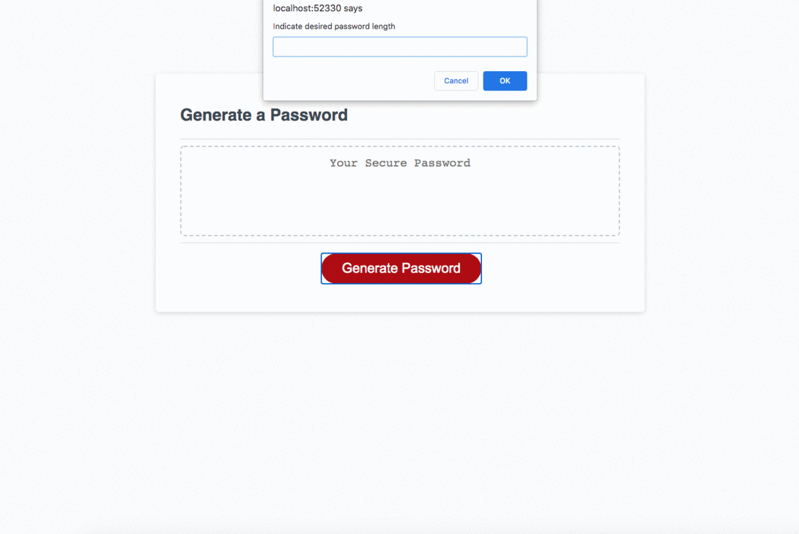

# 03 JavaScript: Password Generator

* this repository contains an index, minimal css, and an extinsive js file that allows users to create generate a password from 8 to 124 characters in length based on user input.

application in practice 

link to deployed application
https://raws-boop.github.io/password-generator/
- - -
© 2021 Trilogy Education Services, LLC, a 2U, Inc. brand. Confidential and Proprietary. All Rights Reserved.
